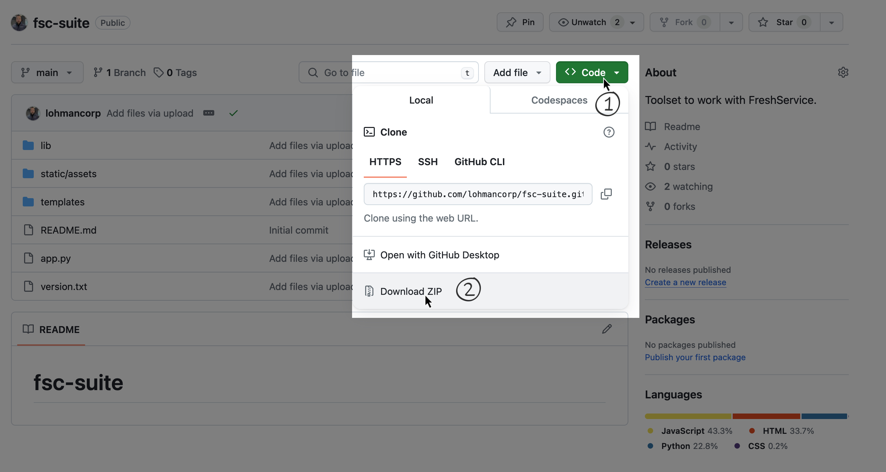

# fsc-suite
The FSC-suite script is a collection of tools that is to be used on-top of an existing FreshService instance.

## Releases
 - v1.0.0 - Alpha Proof of Concept - EOL
 - v1.0.1 - Beta Proof of Concept - EOL
 - v1.0.2 - Public Internal POC - Current

## Setup Instructions
1. Contact local IT to have them install Python 3.6+ on your profile on your local machine.
2. Verify the version of Python installed and that it is available in your profile.

&nbsp;&nbsp;&nbsp;&nbsp;&nbsp;&nbsp; **Windows**
```
py --version
```

&nbsp;&nbsp;&nbsp;&nbsp;&nbsp;&nbsp; **Mac & Linux**
```
python --version
```
   
3. Download the zip archive of the application from GitHub (_you're here now!_)


4. Move the downloaded zip file to a directory of your preference and unzip it.
5. Change directory to the newly unzipped folder (root folder).
6. Create directory named "logs" in the root folder.
   
7. Install dependencies
   
&nbsp;&nbsp;&nbsp;&nbsp;&nbsp;&nbsp; This application is designed to run within a virtual environment.


# First Run instructions 
Please find the appropriate situation and follow the instructions.

&nbsp;&nbsp;&nbsp;&nbsp;&nbsp;&nbsp;**1** If you do not have an API_KEY to run this application, contact your local CBTS or TAM leader.

&nbsp;&nbsp;&nbsp;&nbsp;&nbsp;&nbsp;**2** Depending on your environment setup, you may have to run _pip3_ & _python3_ vs. _pip_ & _python_


### Virtual environment Windows
1. In your command prompt, navigate to the root directory folder of FSC Suite
2. Run the following commands in your command prompt to setup your virutal environment:

```
py -m venv venv
```
```
venv\Scripts\activate
```
```
py -m pip install --upgrade pip
```
```
py -m pip install flask
```
```
py -m pip install requests
```
3. Start the application
```
py -m app.py
```
4. Enter your API key

5. Open your browser and enter the following url: http://127.0.0.1:5000/

To stop the application, use ctrl+c on your keyboard.


### Virtual environment Mac & Linux
1. In your terminal, navigate to the root directory folder of FSC Suite
2. Run the following commands in your command prompt to setup your virutal environment:
```
python -m venv venv
```
```
source venv/bin/activate
```
```
pip install --upgrade pip
```
```
pip install flask
```
```
pip install requests
```
3. Start the application
```
python app.py
```
4. Enter your API key

5. Open your browser and enter the following url: http://127.0.0.1:5000/

To stop the application, use ctrl+c on your keyboard.


# Second Run + instructions 
The following instructions are meant to be used after the initial virtual environment has been setup, but the application has been stopped.

### Virtual environment Windows
1. In your command prompt, navigate to the root directory folder of FSC Suite
2. Start the application
```
py -m app.py
```
3. Enter your API key

4. Open your browser and enter the following url: http://127.0.0.1:5000/

To stop the application, use ctrl+c on your keyboard.

### Virtual environment Mac & Linux
1. In your terminal, navigate to the root directory folder of FSC Suite
2. Start the application
```
python app.py
```
3. Enter your API key

4. Open your browser and enter the following url: http://127.0.0.1:5000/

To stop the application, use ctrl+c on your keyboard.
